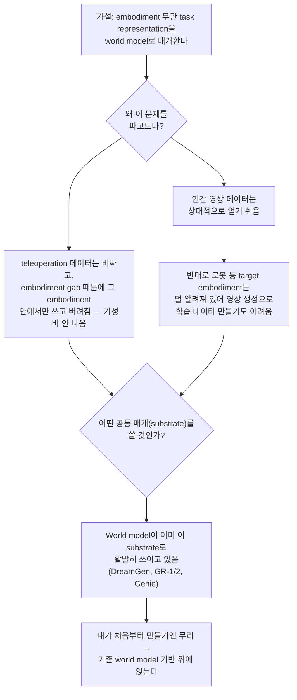

# taskcraft 포지셔닝 문서

작성 시작: 2026-07-21. 매주 갱신한다 (갱신 로그는 문서 맨 아래).

이 문서의 목적은 실험 결과 리포트가 아니라, "왜 이 문제가 흥미롭고, 기존 연구와
정확히 어디서 갈라지는가"를 나 자신과 다른 사람(랩 컨택 상대 등)에게 설명하기
위한 것이다. 10주 실험(BC vs DAgger vs PPO)이 실패하거나 중간에 멈추더라도, 이
문서는 그것과 별개로 남긴다.

## 1. 문제의식

사람은 도구 사용법을 배울 때 대개 다른 사람이 하는 걸 보고 배운다 — 손 모양,
관절 각도, 근육 움직임을 그대로 따라 하는 게 아니라 "이 도구를 이렇게 쥐고
이런 순서로 움직이면 저 결과가 나온다"는 것을 본다. 반면 로봇이나 게임
에이전트에게 사람 시연 영상을 학습시키는 대부분의 방법은, 영상에서 뽑아낸
신호를 그 에이전트 **자신의** 행동 공간(관절 각도, 키보드 입력 등)에 직접
연결한다. 그 결과 학습된 표현은 "이 특정 신체가 이 특정 조작을 어떻게
하는가"에 묶여서, 신체 구조(embodiment)가 다른 에이전트로는 재사용할 수 없다.

질문: 사람 시연 영상에서 **신체 구조에 종속되지 않는** task representation을
뽑아낼 수 있다면, 그 표현을 형태가 다른 에이전트에도 이식할 수 있는가?

**Minecraft는 이 질문을 다루기 위한 도구일 뿐, 최종 타겟이 아니다.** Minecraft를
고른 이유는 통제 가능하고 비용이 싸기 때문이지(2026-07-21 재확인), 최종적으로
답해야 할 질문은 연속적인 제어(로봇 관절 등)와 형태가 근본적으로 다른
embodiment까지 포괄한다. 이후 절의 비교/분석에서 Minecraft 고유의 특성(이산
행동 공간 등)에 매몰되지 않도록 주의한다.

## 2. 아이디어: Latent World Model을 매개로 삼은 embodiment 무관 표현

가설: 영상에서 직접 행동을 예측하는 대신, "이 행동이 세계 상태를 어떻게
바꾸었는가"를 표현하는 latent world model을 매개로 삼으면, 그 표현(상태·전이
표현)은 특정 신체의 관절/조작 방식에 덜 종속적일 수 있다. 이 latent를 공유
인터페이스로 두고, embodiment마다 다른 디코더(정책)를 붙이면 같은 task
representation을 여러 형태의 에이전트에 이식할 수 있을 것이라고 본다.

이 문서를 쓰는 시점(2026-07-21)에서 이 가설은 **검증되지 않았다.** 아래
"파일럿 현황"은 이 가설 자체가 아니라, 이 가설을 실험하기 위한 최소 환경/기반
(BC/DAgger/PPO 비교)의 진행 상황이다.

## 3. 선행연구 지형

### 3.1 Minecraft 에이전트 계열 — "같은 embodiment 안에서" 문제를 푼다

- **VPT (Video PreTraining)**: 라벨 없는 대량 유튜브 게임플레이 영상과, 소량의
  라벨 있는 데이터로 학습한 IDM(inverse dynamics model, 영상에서 행동을
  역추정하는 모델)을 결합해 의사(pseudo) 행동 라벨을 만들고, 그걸로 대규모
  behavior cloning(행동 복제, 이하 BC)을 한다. 핵심 기여는 "라벨 없는 영상도
  행동 학습에 쓸 수 있게 만든 것"이다. 다만 학습된 정책은 Minecraft
  플레이어라는 고정된 행동 공간(마우스/키보드)에 직접 연결되어 있다.
- **GROOT (Learning to Follow Instructions by Watching Gameplay Videos)**:
  게임플레이 영상을 목표(goal) 지시로 인코딩해서 정책을 조건화하는 Minecraft
  전용 연구. "영상을 그대로 목표 신호로 쓴다"는 점에서 방향이 닿아 있지만,
  여전히 Minecraft 안에서 Minecraft 영상을 보고 Minecraft 안에서 행동하는
  문제다 — embodiment가 바뀌지 않는다. **주의(2026-07-21 정정)**: 이 논문은
  NVIDIA의 로봇 파운데이션 모델 "GR00T N1"과 이름이 비슷할 뿐 전혀 다른
  프로젝트다. dual-system 구조는 GR00T N1 쪽 특징이며, 3.4절에 별도로 정리한다.
- **STEVE-1**: VPT와 같은 인코더를 공유하면서 텍스트/영상 프롬프트로 정책을
  조작 가능하게 만든 연구. 조작성(controllability)이 핵심 기여이지,
  embodiment 이식은 다루지 않는다.
- **DreamerV3**: latent dynamics model(세계의 상태 변화를 예측하는 압축된
  표현) 안에서 상상으로 정책을 학습하는 범용 world model 기반 RL. Minecraft에서
  사람 데이터 없이 다이아몬드를 캐낸 결과로 널리 알려짐. "world model이 제어의
  공통 기반이 될 수 있다"는 원리를 보여주지만, 영상 모방이나 embodiment 전이는
  다루지 않는다.
- **Voyager**: LLM으로 코드를 생성해 정책으로 쓰고, 실패를 통해 스킬
  라이브러리를 자동으로 쌓는 장기 계획/커리큘럼 구조. 저수준 perception-action
  학습과는 독립적인, 상위 계획 레이어에 가깝다.

### 3.2 World model 기반 cross-embodiment 로봇 학습 계열 — 실제로 "이식"을 다루고 있고, 이미 붐빈다

2026-07-21 추가. 이 계열이 최종 비전의 핵심 주장과 가장 직접적으로 비교해야 할
선행연구다. **중요: 이 영역은 비어있지 않다.** NVIDIA·ByteDance·DeepMind가
2024~2025년에 이미 활발히 채우고 있는, 경쟁이 있는 프론티어다.

- **R3M / VIP**: 인간 영상에서 로봇에 전이 가능한 시각 표현(R3M) 또는 목표까지
  남은 진행도를 나타내는 시간적 표현(VIP)을 학습한다.
- **Genie (DeepMind, 2024)**: 라벨 없는 인터넷 게임 영상만으로, 프레임 사이의
  "잠재 행동(latent action)"을 완전 비지도로 학습한다. 행동 라벨 없이 영상에서
  embodiment 무관한 행동 유사 표현을 뽑아내는 실제 사례라 이 프로젝트와 가장
  가깝다.
- **UniPi / UniSim**: 영상 생성 모델 자체를 정책의 공통 인터페이스로 쓰는
  접근("다음에 어떤 장면이 와야 하는가"를 생성하고 그걸 행동으로 옮김).
- **[DreamGen](https://arxiv.org/abs/2505.12705) (NVIDIA, 2025)**: 영상
  생성 world model에서 로봇 행동을 얻는 두 방식(일반 latent action model에서
  행동 추출 vs IDM으로 행동 예측)을 직접 비교한다. "공유 latent 인터페이스에서
  어떤 정보를 쓸 것인가"라는 질문을 이미 논문으로 다루고 있다.
- **GR-1 → GR-2 (ByteDance)**: 대규모 텍스트-영상 페어(GR-2는 3800만 클립)로
  영상 예측을 사전학습하고, 로봇 데이터로 파인튜닝. GR-2는 행동 헤드를 MLP에서
  CVAE(생성 모델)로 교체했다.
- **Genie Envisioner (2025)**: 로봇 센싱·정책학습·평가를 하나의 영상 생성
  world model로 통합.
- **RT-X / Open X-Embodiment**: 여러 종류의 실제 로봇 데이터를 하나의 정책으로
  묶으려는 cross-embodiment 학습의 실제 사례. 다만 22종 로봇이 전부 팔+그리퍼
  계열로, 서로 **비슷한** embodiment 집합이다 (3.5절 참고).

### 3.3 Morphology-conditioned / modular RL 계열

2026-07-21 추가. "공유 latent에서 embodiment별 특성에 맞게 필요한 정보를
matching해서 추출한다"는 아이디어를 떠올렸을 때, 이미 존재하는 갈래.

- **NerveNet (2018)**: 에이전트의 몸 구조를 그래프(관절=노드)로 표현하고, GNN을
  정책으로 써서 하나의 네트워크가 서로 다른 몸 구조에 다르게 반응하도록 학습.
- **MetaMorph (2022)**: 트랜스포머 기반으로, 수천 종의 무작위 생성 로봇
  형태로 학습해 본 적 없는 형태에도 일반화하는 단일 정책.

두 연구 모두 "형태가 다른 로봇들"을 다루긴 하지만, 로봇 시뮬레이션 안에서
생성된 몸 구조들이라 R3M/VIP/DreamGen 계열과 마찬가지로 **서로 어느 정도 닮은
집합** 안에서의 일반화다.

### 3.4 참고: NVIDIA GR00T N1 (로봇 파운데이션 모델, 3.1의 Minecraft GROOT와는 별개)

Vision-Language-Action(VLA) 구조의 휴머노이드 로봇 파운데이션 모델. System2
(VLM 기반 목표/추론) + System1(디퓨전 트랜스포머 기반 실시간 실행)로 나뉜
dual-system 구조가 최종 비전(목표 인코딩과 실행을 분리)의 아이디어 원류에
가깝다. 2025-03 N1 발표 이후 N1.5(2025-06) → N1.6(2025-09) → N1.7(2026-04,
2026-07-21 기준 최신)까지 갱신됨. 코어 아이디어는 유지되므로 원 논문(N1,
arXiv:2503.14734)을 인용하되 최신 버전이 있다는 점은 각주로 남긴다.

### 3.5 이 프로젝트가 실제로 갈라지는 지점 (2026-07-21 재정리)

기존에는 "world model을 명시적 매개로 쓴다"는 것 자체가 차별점이라고 썼는데,
DreamGen이 이미 이걸 하고 있어서 그것만으로는 차별점이 되지 않는다. 더 정확한
차이는 **embodiment 집합의 범위**에 있다:

| | 3.2/3.3의 cross-embodiment 연구 | taskcraft 최종 비전 |
|---|---|---|
| 다루는 embodiment 집합 | 로봇 팔/그리퍼류(R3M, DreamGen, RT-X), 혹은 시뮬레이션 안에서 무작위 생성된 로봇 형태(NerveNet, MetaMorph) — **서로 닮은 집합** | 인간, 로봇, 게임 아바타 등 **형태가 근본적으로 다른 집합** |
| 암묵적 가정 | embodiment들이 어느 정도 공유하는 구조(관절 그래프, 팔+그리퍼 기구학)가 있다고 전제 | 그런 공유 구조가 없어도 통하는 표현을 찾고자 함 (더 어려운 주장) |

**이 차이가 실제로 유의미한지는 아직 열린 질문이다** (5절 참고). "닮은 집합
안에서의 일반화"와 "근본적으로 다른 형태 간의 전이"가 정도의 차이인지, 질적으로
다른 문제인지부터 먼저 따져야 한다.

## 4. 파일럿 현황 (10주 실험, 근거 자료용)

| 마일스톤 | 상태 |
|---|---|
| 환경/도구 세팅 (Windows 네이티브 MineRL) | ✅ 완료. docs/research_notes/04 |
| Observation pipeline | 미착수 |
| BC baseline | 미착수 |
| DAgger 비교 | 미착수 |
| PPO 비교 | 미착수 |

## 5. 열린 질문 / 랩에서 이어가고 싶은 것

- world model의 상태-전이 표현이 정말로 embodiment에 덜 종속적인지, 아니면
  결국 학습 데이터의 embodiment 분포에 다시 종속되는지 — 이론적으로도,
  실증적으로도 아직 답이 없다.
- **"닮은 embodiment 집합 안의 일반화"(3.2/3.3)와 "형태가 근본적으로 다른
  embodiment 간 전이"(taskcraft 비전)가 정말 질적으로 다른 문제인지, 아니면
  전자를 확장하면 후자가 되는 정도의 차이인지 — 이걸 구분하지 못하면 차별점
  주장이 무너진다.**
- world model + cross-embodiment 조합 자체는 NVIDIA/ByteDance/DeepMind가
  2024~2025년에 이미 활발히 다루는 영역이다. "아무도 안 한 걸 먼저 한다"는
  주장은 성립하지 않는다 — 대신 이 최전선 논문들이 서로 다른 선택을 한 지점
  (latent action model vs IDM, 로봇 시뮬레이션 안 무작위 형태 vs 실측
  embodiment)을 정리하고, 그중 무엇이 "형태가 근본적으로 다른 집합"까지
  확장 가능한지에 대한 관점을 세우는 것이 지금 단계에 현실적인 목표다.
- Minecraft(가상 환경, 이산적 도구 사용)에서 검증된 것이 실제 로봇(연속
  제어, 물리 노이즈)으로 얼마나 일반화될지는 별개의 큰 질문.
- (부수적, 우선순위 낮음) embodiment별 디코더를 어떻게 구현할지의 문제 —
  discrete diffusion/flow matching 같은 생성적 action head를 쓸 수 있는지는
  "공유 latent에 뭘 담을 것인가"라는 핵심 질문과는 별개 축이다.

## 6. 사고 흐름 기록 (질문 로그)

이 절은 매주 던진 질문과 그에 대한 판단을 그대로 남긴다 — 결론이 나중에
틀린 것으로 밝혀지더라도 고치지 않고, 새 항목으로 덧붙인다.

### 2026-07-21

**Q1. BC/DAgger가 "embodiment 종속"과 관련된 분류야?**
아니다. BC/DAgger/PPO는 전부 "관측 → 이 embodiment의 행동"을 직접 학습한다는
점에서 같은 축에 있다. BC vs DAgger는 데이터 수집 전략(distribution shift
대응 방식)의 차이일 뿐, embodiment 종속 여부와는 별개 축이다. "task
representation"도 표준 기법 하나가 아니라 논문마다 다르게 구현하는 느슨한
개념이다 (목표 이미지 임베딩, 영상 전체 latent, progress 함수, 이 프로젝트의
경우 world model의 상태-전이 궤적).

**Q2. Latent world model은 어디서 발전했나?**
Dyna(고전 model-based RL) → World Models(Ha & Schmidhuber 2018, 용어의
현대적 기원) → PlaNet → Dreamer/V2/V3 → MuZero(다른 갈래: 관측 복원 없이
가치 예측에 필요한 만큼만 맞는 모델) → Genie(2024, 라벨 없이 영상에서 잠재
행동 추출) → DreamGen/GR-1·GR-2/Genie Envisioner(2025, 영상 world model
→ 로봇 cross-embodiment 실전 적용).

**Q3. 인코더/디코더의 역할, 디퓨전과의 관계는?**
인코더는 고차원 관측을 저차원 latent로 압축. "디코더"는 두 가지 다른 의미로
쓰인다 — (a) latent → 픽셀 복원(생성적 디코더, VAE/디퓨전), (b) latent →
특정 embodiment의 행동(정책 디코더). 디퓨전의 U-Net이 인코더-디코더처럼
보이는 건 반복적 노이즈 제거 아키텍처라서지, "압축 후 복원"의 의미가 아니다.
공유 latent를 embodiment별로 연결하는 디코더 설계는 고정된 회로가 아니라
열린 설계 공간이며, 실제로는 (1) 공유 trunk + embodiment별 얕은 헤드,
(2) 행동을 공유 vocabulary로 토큰화 + embodiment별 디토크나이저, (3)
embodiment별 inverse-dynamics 디코더(DreamGen이 이 방식과 latent action
방식을 직접 비교) 정도의 패턴이 알려져 있다.

**Q4. GROOT 최신 버전이 1.2 아니야?**
"GROOT"(Minecraft, 영상을 지시문처럼 쓰는 논문)와 "GR00T N1"(NVIDIA 휴머노이드
로봇 VLA, dual-system)은 이름만 비슷한 별개 프로젝트다. 기존 roadmap.md가
이 둘을 섞어놨었다 (정정 완료, 3.1/3.4 참고). NVIDIA GR00T는 N1(2025-03) →
N1.5 → N1.6 → N1.7(2026-04, 확인 시점 기준 최신)까지 나왔다.

**Q5. World model + R3M/VIP 조합이 비어있는 영역 아니야? 빠르게 초기 성과를
낼 수 있지 않을까?**
아니다. DreamGen(NVIDIA)/GR-1·GR-2(ByteDance)/Genie Envisioner(2025)가
정확히 이 조합을 이미 다루고 있다. "world model에서 어떤 정보를 쓸 것인가"
자체가 이미 논문 주제다. 진짜 차별점은 3.5절대로 "embodiment 집합의 범위"
쪽에서 찾아야 한다. 데이터도 지금 단계에선 공모전/그랜트보다 이미 공개된
Open X-Embodiment, Minecraft BASALT, Ego4D/Epic-Kitchens 등으로 충분하다.

**Q6. Discrete 환경에 생성적 action head(디퓨전/flow matching)를 얹으면?**
트렌드에는 맞다(π0/π0.5, RDT-1B, GR-2의 CVAE 헤드). 다만 이 방법들은 연속
제어를 전제하고, Minecraft는 이산+연속이 섞여 있어 discrete
diffusion/flow matching으로 적응이 필요하다. 이건 "embodiment별 디코더를
어떻게 구현할지"(Q3, 부수적 축)의 문제이지, "공유 latent에 뭘 담을지"(핵심
축)의 문제가 아니다 — 섞어서 설명하면 핵심 주장이 흐려진다.

**Q7. 기존 cross-embodiment 연구도 결국 "닮은 embodiment 집합" 안의 문제
아니야? 우리는 전체 embodiment에 대한 정보를 가져오려는 것 아니야?**
맞다. R3M/DreamGen/RT-X는 로봇 팔+그리퍼류, NerveNet/MetaMorph는 시뮬레이션
안에서 생성된 로봇 형태 — 전부 서로 어느 정도 닮은 집합이다. taskcraft
최종 비전이 말하는 "형태가 근본적으로 다른 embodiment 간 전이"는 이보다
넓은 주장이고, 이게 3.5절에서 정리한 실제 차별점이다. 다만 이 차이가
질적인지 정도의 차이인지는 아직 검증 안 됨 (5절 열린 질문).

### 사고 흐름 예시: 왜 이 가설을 파고드는가

## 갱신 로그
- 2026-07-21: 문서 최초 작성. 선행연구 지형(3.1, 3.2) 정리, cross-embodiment
  계열을 roadmap.md 우선순위 논문에 추가.
- 2026-07-21 (2차): Minecraft는 도구일 뿐 최종 타겟이 아님을 1절에 명시.
  GROOT(Minecraft)와 GR00T N1(NVIDIA)을 분리(3.1, 3.4). Genie/DreamGen/
  GR-1·GR-2/Genie Envisioner 추가(3.2), NerveNet/MetaMorph 추가(3.3).
  차별점을 "world model을 매개로 쓴다"에서 "embodiment 집합의 범위"로
  재정리(3.5). 오늘 던진 질문 7개를 6절에 로그로 기록.
