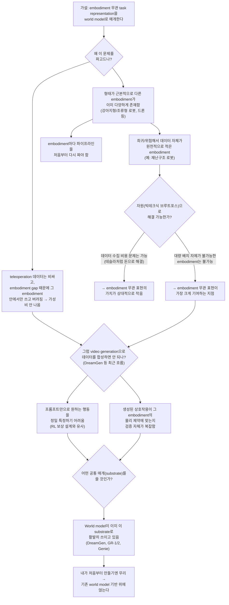

# taskcraft 포지셔닝 문서

작성 시작: 2026-07-21. 매주 갱신한다 (갱신 로그는 문서 맨 아래).

이 문서의 목적은 실험 결과 리포트가 아니라, "왜 이 문제가 흥미롭고, 기존 연구와
정확히 어디서 갈라지는가"를 나 자신과 다른 사람(랩 컨택 상대 등)에게 설명하기
위한 것이다. 10주 실험(BC vs DAgger vs PPO)이 실패하거나 중간에 멈추더라도, 이
문서는 그것과 별개로 남긴다.

## 1. 문제의식

사람은 도구 사용법을 배울 때 대개 다른 사람이 하는 걸 보고 배운다 — 손 모양,
관절 각도, 근육 움직임을 그대로 따라 하는 게 아니라 "이 도구를 이렇게 쥐고
이런 순서로 움직이면 저 결과가 나온다"는 것을 본다. 반면 로봇이나 게임
에이전트에게 사람 시연 영상을 학습시키는 대부분의 방법은, 영상에서 뽑아낸
신호를 그 에이전트 **자신의** 행동 공간(관절 각도, 키보드 입력 등)에 직접
연결한다. 그 결과 학습된 표현은 "이 특정 신체가 이 특정 조작을 어떻게
하는가"에 묶여서, 신체 구조(embodiment)가 다른 에이전트로는 재사용할 수 없다.

질문: 사람 시연 영상에서 **신체 구조에 종속되지 않는** task representation을
뽑아낼 수 있다면, 그 표현을 형태가 다른 에이전트에도 이식할 수 있는가?

### 1.1 왜 embodiment 무관 표현이 중요한가 (2026-07-21 보강)

처음엔 "로봇 등 target embodiment를 잘 모른다"는 식으로 근거를 댔는데, 이건
틀렸다 — 강아지형 로봇, 조류형 로봇, 드론 등 **형태가 근본적으로 다른 구조가
이미 다양하게 존재**한다. 문제는 몰라서가 아니라, 이 다양성 자체 때문에
embodiment마다 파이프라인을 처음부터 다시 짜야 한다는 것이다. 이 다양성이
실제로 문제가 되는 지점은 최소 세 가지다.

1. **데이터 수집 비용**: embodiment마다 teleoperation(원격 조작으로 시연
   데이터를 모으는 것)을 다시 해야 하면, embodiment 수만큼 비용이 선형으로
   늘어난다.
2. **파이프라인 비재사용성**: 기존 embodiment용으로 만든 인코더/정책이 새
   형태(예: 조류형 로봇)에는 처음부터 다시 설계해야 해서 전혀 재사용이
   안 된다.
3. **희귀하거나 위험해서 데이터 자체가 근본적으로 적은 embodiment가 있다.**
   이게 이 아이디어를 처음 떠올릴 때 가장 크게 고민했던 지점이다 —
   **재난구조 로봇**. 실제 재난 상황(붕괴 건물, 방사능/화재 구역)은 예측
   불가능하고 재현이 안 되며, 데이터 수집만을 위해 로봇을 위험 상황에
   반복 투입하는 것 자체가 비용이 크거나 불가능하다. 게다가 이런 로봇은
   설계가 표준화되지 않고 소량 생산되는 경우가 많다.

**여기서 중요한 비대칭이 하나 있다.** 데이터 수집 비용 문제는 원칙적으로
"돈을 많이 쓰면" 어느 정도 해결된다 — 테슬라 같은 빅테크 기업은 실제로
막대한 teleoperation 인력과 실물 로봇 대수로 이 문제를 정면 돌파한다.
하지만 이 방식은 (a) 자원이 제한된 연구자/팀에게는 애초에 선택지가 아니고,
(b) 재난구조 로봇처럼 **애초에 대량 생산/대량 배치 자체가 불가능한
embodiment**에는 돈을 아무리 써도 통하지 않는다 — "붕괴 현장"을 실물
Optimus 조립하듯 찍어낼 수는 없기 때문이다. 즉 embodiment 무관 표현이
실제로 가장 크게 기여할 수 있는 지점은, **자원으로 밀어붙일 수 없는
지점**(자원 제약이 있는 연구자, 그리고 태생적으로 희귀/위험한 embodiment)
이라고 본다.

**Video generation으로 학습 데이터를 대신 만들면 되지 않나?** 최근 흐름
(DreamGen, Genie Envisioner)이 실제로 이 방향이다 — 영상 생성 모델로 학습에
쓸 상호작용 영상 자체를 합성한다. 다만 두 가지 문제가 있다고 본다.
1. 프롬프트만으로 원하는 행동을 정밀하게 특정하기 어렵다 — RL의 보상
   설계와 비슷하게, "무엇을 원하는가"를 언어/프롬프트로 완전히
   명세하기가 근본적으로 어렵다(under-specified).
2. 생성된 상호작용이 특정 embodiment의 물리적 제약(관절 가동 범위, 접촉
   동역학 등)에 실제로 부합하는지(plausibility) 검증하는 절차 자체가
   복잡하다 — 결국 그 embodiment에 맞는 시뮬레이터나 판별기가 다시
   필요해서, 피하려던 embodiment-specific 엔지니어링이 다른 형태로
   되돌아온다.

이 두 문제가 "영상 생성만으로 데이터 부족 문제를 완전히 대체할 수 없고,
embodiment 무관 표현이 별도로 필요한 이유"에 대한 근거라고 본다. 다만 이
논리 자체도 아직 검증된 것은 아니다 — 5절 열린 질문에 남긴다.

**Minecraft는 이 질문을 다루기 위한 도구일 뿐, 최종 타겟이 아니다.** Minecraft를
고른 이유는 통제 가능하고 비용이 싸기 때문이지(2026-07-21 재확인), 최종적으로
답해야 할 질문은 연속적인 제어(로봇 관절 등)와 형태가 근본적으로 다른
embodiment까지 포괄한다. 이후 절의 비교/분석에서 Minecraft 고유의 특성(이산
행동 공간 등)에 매몰되지 않도록 주의한다.

## 2. 아이디어: Latent World Model을 매개로 삼은 embodiment 무관 표현

가설: 영상에서 직접 행동을 예측하는 대신, "이 행동이 세계 상태를 어떻게
바꾸었는가"를 표현하는 latent world model을 매개로 삼으면, 그 표현(상태·전이
표현)은 특정 신체의 관절/조작 방식에 덜 종속적일 수 있다. 이 latent를 공유
인터페이스로 두고, embodiment마다 다른 디코더(정책)를 붙이면 같은 task
representation을 여러 형태의 에이전트에 이식할 수 있을 것이라고 본다.

이 문서를 쓰는 시점(2026-07-21)에서 이 가설은 **검증되지 않았다.** 아래
"파일럿 현황"은 이 가설 자체가 아니라, 이 가설을 실험하기 위한 최소 환경/기반
(BC/DAgger/PPO 비교)의 진행 상황이다.

## 3. 선행연구 지형

### 3.1 Minecraft 에이전트 계열 — "같은 embodiment 안에서" 문제를 푼다

- **VPT (Video PreTraining)**: 라벨 없는 대량 유튜브 게임플레이 영상과, 소량의
  라벨 있는 데이터로 학습한 IDM(inverse dynamics model, 영상에서 행동을
  역추정하는 모델)을 결합해 의사(pseudo) 행동 라벨을 만들고, 그걸로 대규모
  behavior cloning(행동 복제, 이하 BC)을 한다. 핵심 기여는 "라벨 없는 영상도
  행동 학습에 쓸 수 있게 만든 것"이다. 다만 학습된 정책은 Minecraft
  플레이어라는 고정된 행동 공간(마우스/키보드)에 직접 연결되어 있다.
- **GROOT (Learning to Follow Instructions by Watching Gameplay Videos)**:
  게임플레이 영상을 목표(goal) 지시로 인코딩해서 정책을 조건화하는 Minecraft
  전용 연구. "영상을 그대로 목표 신호로 쓴다"는 점에서 방향이 닿아 있지만,
  여전히 Minecraft 안에서 Minecraft 영상을 보고 Minecraft 안에서 행동하는
  문제다 — embodiment가 바뀌지 않는다. **주의(2026-07-21 정정)**: 이 논문은
  NVIDIA의 로봇 파운데이션 모델 "GR00T N1"과 이름이 비슷할 뿐 전혀 다른
  프로젝트다. dual-system 구조는 GR00T N1 쪽 특징이며, 3.4절에 별도로 정리한다.
- **STEVE-1**: VPT와 같은 인코더를 공유하면서 텍스트/영상 프롬프트로 정책을
  조작 가능하게 만든 연구. 조작성(controllability)이 핵심 기여이지,
  embodiment 이식은 다루지 않는다.
- **DreamerV3**: latent dynamics model(세계의 상태 변화를 예측하는 압축된
  표현) 안에서 상상으로 정책을 학습하는 범용 world model 기반 RL. Minecraft에서
  사람 데이터 없이 다이아몬드를 캐낸 결과로 널리 알려짐. "world model이 제어의
  공통 기반이 될 수 있다"는 원리를 보여주지만, 영상 모방이나 embodiment 전이는
  다루지 않는다.
- **Voyager**: LLM으로 코드를 생성해 정책으로 쓰고, 실패를 통해 스킬
  라이브러리를 자동으로 쌓는 장기 계획/커리큘럼 구조. 저수준 perception-action
  학습과는 독립적인, 상위 계획 레이어에 가깝다.

### 3.2 World model 기반 cross-embodiment 로봇 학습 계열 — 실제로 "이식"을 다루고 있고, 이미 붐빈다

2026-07-21 추가. 이 계열이 최종 비전의 핵심 주장과 가장 직접적으로 비교해야 할
선행연구다. **중요: 이 영역은 비어있지 않다.** NVIDIA·ByteDance·DeepMind가
2024~2025년에 이미 활발히 채우고 있는, 경쟁이 있는 프론티어다.

- **R3M / VIP**: 인간 영상에서 로봇에 전이 가능한 시각 표현(R3M) 또는 목표까지
  남은 진행도를 나타내는 시간적 표현(VIP)을 학습한다.
- **Genie (DeepMind, 2024)**: 라벨 없는 인터넷 게임 영상만으로, 프레임 사이의
  "잠재 행동(latent action)"을 완전 비지도로 학습한다. 행동 라벨 없이 영상에서
  embodiment 무관한 행동 유사 표현을 뽑아내는 실제 사례라 이 프로젝트와 가장
  가깝다.
- **UniPi / UniSim**: 영상 생성 모델 자체를 정책의 공통 인터페이스로 쓰는
  접근("다음에 어떤 장면이 와야 하는가"를 생성하고 그걸 행동으로 옮김).
- **[DreamGen](https://arxiv.org/abs/2505.12705) (NVIDIA, 2025)**: 영상
  생성 world model에서 로봇 행동을 얻는 두 방식(일반 latent action model에서
  행동 추출 vs IDM으로 행동 예측)을 직접 비교한다. "공유 latent 인터페이스에서
  어떤 정보를 쓸 것인가"라는 질문을 이미 논문으로 다루고 있다.
- **GR-1 → GR-2 (ByteDance)**: 대규모 텍스트-영상 페어(GR-2는 3800만 클립)로
  영상 예측을 사전학습하고, 로봇 데이터로 파인튜닝. GR-2는 행동 헤드를 MLP에서
  CVAE(생성 모델)로 교체했다.
- **Genie Envisioner (2025)**: 로봇 센싱·정책학습·평가를 하나의 영상 생성
  world model로 통합.
- **RT-X / Open X-Embodiment**: 여러 종류의 실제 로봇 데이터를 하나의 정책으로
  묶으려는 cross-embodiment 학습의 실제 사례. 다만 22종 로봇이 전부 팔+그리퍼
  계열로, 서로 **비슷한** embodiment 집합이다 (3.5절 참고).

### 3.3 Morphology-conditioned / modular RL 계열

2026-07-21 추가. "공유 latent에서 embodiment별 특성에 맞게 필요한 정보를
matching해서 추출한다"는 아이디어를 떠올렸을 때, 이미 존재하는 갈래.

- **NerveNet (2018)**: 에이전트의 몸 구조를 그래프(관절=노드)로 표현하고, GNN을
  정책으로 써서 하나의 네트워크가 서로 다른 몸 구조에 다르게 반응하도록 학습.
- **MetaMorph (2022)**: 트랜스포머 기반으로, 수천 종의 무작위 생성 로봇
  형태로 학습해 본 적 없는 형태에도 일반화하는 단일 정책.

두 연구 모두 "형태가 다른 로봇들"을 다루긴 하지만, 로봇 시뮬레이션 안에서
생성된 몸 구조들이라 R3M/VIP/DreamGen 계열과 마찬가지로 **서로 어느 정도 닮은
집합** 안에서의 일반화다.

### 3.4 참고: NVIDIA GR00T N1 (로봇 파운데이션 모델, 3.1의 Minecraft GROOT와는 별개)

Vision-Language-Action(VLA) 구조의 휴머노이드 로봇 파운데이션 모델. System2
(VLM 기반 목표/추론) + System1(디퓨전 트랜스포머 기반 실시간 실행)로 나뉜
dual-system 구조가 최종 비전(목표 인코딩과 실행을 분리)의 아이디어 원류에
가깝다. 2025-03 N1 발표 이후 N1.5(2025-06) → N1.6(2025-09) → N1.7(2026-04,
2026-07-21 기준 최신)까지 갱신됨. 코어 아이디어는 유지되므로 원 논문(N1,
arXiv:2503.14734)을 인용하되 최신 버전이 있다는 점은 각주로 남긴다.

### 3.5 이 프로젝트가 실제로 갈라지는 지점 (2026-07-21 재정리)

기존에는 "world model을 명시적 매개로 쓴다"는 것 자체가 차별점이라고 썼는데,
DreamGen이 이미 이걸 하고 있어서 그것만으로는 차별점이 되지 않는다. 더 정확한
차이는 **embodiment 집합의 범위**에 있다:

| | 3.2/3.3의 cross-embodiment 연구 | taskcraft 최종 비전 |
|---|---|---|
| 다루는 embodiment 집합 | 로봇 팔/그리퍼류(R3M, DreamGen, RT-X), 혹은 시뮬레이션 안에서 무작위 생성된 로봇 형태(NerveNet, MetaMorph) — **서로 닮은 집합** | 인간, 로봇, 게임 아바타 등 **형태가 근본적으로 다른 집합** |
| 암묵적 가정 | embodiment들이 어느 정도 공유하는 구조(관절 그래프, 팔+그리퍼 기구학)가 있다고 전제 | 그런 공유 구조가 없어도 통하는 표현을 찾고자 함 (더 어려운 주장) |

**이 차이가 실제로 유의미한지는 아직 열린 질문이다** (5절 참고). "닮은 집합
안에서의 일반화"와 "근본적으로 다른 형태 간의 전이"가 정도의 차이인지, 질적으로
다른 문제인지부터 먼저 따져야 한다.

## 4. 파일럿 현황 (근거 자료용, 2026-08-12부터 스코프 재검토 중 — 6절 Q9~Q12 참고)

| 마일스톤 | 상태 |
|---|---|
| 환경/도구 세팅 (Windows 네이티브 MineRL) | ✅ 완료. docs/research_notes/04 |
| Observation pipeline (VPT/R3M/VIP/CLIP 인코더 통합) | ✅ 완료. docs/research_notes/05 |
| [이론] 시리즈 (13편, akileo-vault 발행) | 미착수 — 8월 안에 완료 목표 |
| 간이 cross-embodiment 파일럿 (Minecraft 내 embodiment 교체) | 설계 전 — target embodiment/task 미정 (6절 Q13 참고) |
| BC vs DAgger vs PPO (Minecraft) | 보류 — 6절 Q9 참고, 핵심 가설을 직접 검증하지
  않는다는 판단으로 우선순위 낮춤. 재개 여부 미정 |

## 5. 열린 질문 / 랩에서 이어가고 싶은 것

- world model의 상태-전이 표현이 정말로 embodiment에 덜 종속적인지, 아니면
  결국 학습 데이터의 embodiment 분포에 다시 종속되는지 — 이론적으로도,
  실증적으로도 아직 답이 없다.
- **"닮은 embodiment 집합 안의 일반화"(3.2/3.3)와 "형태가 근본적으로 다른
  embodiment 간 전이"(taskcraft 비전)가 정말 질적으로 다른 문제인지, 아니면
  전자를 확장하면 후자가 되는 정도의 차이인지 — 이걸 구분하지 못하면 차별점
  주장이 무너진다.**
- world model + cross-embodiment 조합 자체는 NVIDIA/ByteDance/DeepMind가
  2024~2025년에 이미 활발히 다루는 영역이다. "아무도 안 한 걸 먼저 한다"는
  주장은 성립하지 않는다 — 대신 이 최전선 논문들이 서로 다른 선택을 한 지점
  (latent action model vs IDM, 로봇 시뮬레이션 안 무작위 형태 vs 실측
  embodiment)을 정리하고, 그중 무엇이 "형태가 근본적으로 다른 집합"까지
  확장 가능한지에 대한 관점을 세우는 것이 지금 단계에 현실적인 목표다.
- Minecraft(가상 환경, 이산적 도구 사용)에서 검증된 것이 실제 로봇(연속
  제어, 물리 노이즈)으로 얼마나 일반화될지는 별개의 큰 질문.
- (부수적, 우선순위 낮음) embodiment별 디코더를 어떻게 구현할지의 문제 —
  discrete diffusion/flow matching 같은 생성적 action head를 쓸 수 있는지는
  "공유 latent에 뭘 담을 것인가"라는 핵심 질문과는 별개 축이다.
- **자원 비대칭 주장이 실제로 성립하는지 검증 필요.** "embodiment 무관 표현은
  자원으로 밀어붙일 수 없는 지점(자원 제약 연구자, 희귀/위험 embodiment)에서
  가장 크게 기여한다"고 봤는데, 정작 그런 상황(재난구조 로봇 등)은 데이터
  자체가 원천적으로 적어서 표현을 학습/검증할 방법도 마찬가지로 부족할 수
  있다 — "데이터가 없어서 필요한 방법"이 "데이터가 없어서 검증도 못 하는
  방법"이 되는 역설이 있는지 확인해야 한다.
- Video generation으로 데이터를 합성하는 접근(DreamGen 등)의 두 한계(프롬프트
  정밀도, embodiment plausibility 검증)가 embodiment 무관 표현 접근에는
  없는지, 아니면 이 접근도 결국 비슷한 형태의 문제를 다른 곳에서 만나는지
  아직 확인 안 됨.

## 6. 사고 흐름 기록 (질문 로그)

이 절은 매주 던진 질문과 그에 대한 판단을 그대로 남긴다 — 결론이 나중에
틀린 것으로 밝혀지더라도 고치지 않고, 새 항목으로 덧붙인다.

### 2026-07-21

**Q1. BC/DAgger가 "embodiment 종속"과 관련된 분류야?**
아니다. BC/DAgger/PPO는 전부 "관측 → 이 embodiment의 행동"을 직접 학습한다는
점에서 같은 축에 있다. BC vs DAgger는 데이터 수집 전략(distribution shift
대응 방식)의 차이일 뿐, embodiment 종속 여부와는 별개 축이다. "task
representation"도 표준 기법 하나가 아니라 논문마다 다르게 구현하는 느슨한
개념이다 (목표 이미지 임베딩, 영상 전체 latent, progress 함수, 이 프로젝트의
경우 world model의 상태-전이 궤적).

**Q2. Latent world model은 어디서 발전했나?**
Dyna(고전 model-based RL) → World Models(Ha & Schmidhuber 2018, 용어의
현대적 기원) → PlaNet → Dreamer/V2/V3 → MuZero(다른 갈래: 관측 복원 없이
가치 예측에 필요한 만큼만 맞는 모델) → Genie(2024, 라벨 없이 영상에서 잠재
행동 추출) → DreamGen/GR-1·GR-2/Genie Envisioner(2025, 영상 world model
→ 로봇 cross-embodiment 실전 적용).

**Q3. 인코더/디코더의 역할, 디퓨전과의 관계는?**
인코더는 고차원 관측을 저차원 latent로 압축. "디코더"는 두 가지 다른 의미로
쓰인다 — (a) latent → 픽셀 복원(생성적 디코더, VAE/디퓨전), (b) latent →
특정 embodiment의 행동(정책 디코더). 디퓨전의 U-Net이 인코더-디코더처럼
보이는 건 반복적 노이즈 제거 아키텍처라서지, "압축 후 복원"의 의미가 아니다.
공유 latent를 embodiment별로 연결하는 디코더 설계는 고정된 회로가 아니라
열린 설계 공간이며, 실제로는 (1) 공유 trunk + embodiment별 얕은 헤드,
(2) 행동을 공유 vocabulary로 토큰화 + embodiment별 디토크나이저, (3)
embodiment별 inverse-dynamics 디코더(DreamGen이 이 방식과 latent action
방식을 직접 비교) 정도의 패턴이 알려져 있다.

**Q4. GROOT 최신 버전이 1.2 아니야?**
"GROOT"(Minecraft, 영상을 지시문처럼 쓰는 논문)와 "GR00T N1"(NVIDIA 휴머노이드
로봇 VLA, dual-system)은 이름만 비슷한 별개 프로젝트다. 기존 roadmap.md가
이 둘을 섞어놨었다 (정정 완료, 3.1/3.4 참고). NVIDIA GR00T는 N1(2025-03) →
N1.5 → N1.6 → N1.7(2026-04, 확인 시점 기준 최신)까지 나왔다.

**Q5. World model + R3M/VIP 조합이 비어있는 영역 아니야? 빠르게 초기 성과를
낼 수 있지 않을까?**
아니다. DreamGen(NVIDIA)/GR-1·GR-2(ByteDance)/Genie Envisioner(2025)가
정확히 이 조합을 이미 다루고 있다. "world model에서 어떤 정보를 쓸 것인가"
자체가 이미 논문 주제다. 진짜 차별점은 3.5절대로 "embodiment 집합의 범위"
쪽에서 찾아야 한다. 데이터도 지금 단계에선 공모전/그랜트보다 이미 공개된
Open X-Embodiment, Minecraft BASALT, Ego4D/Epic-Kitchens 등으로 충분하다.

**Q6. Discrete 환경에 생성적 action head(디퓨전/flow matching)를 얹으면?**
트렌드에는 맞다(π0/π0.5, RDT-1B, GR-2의 CVAE 헤드). 다만 이 방법들은 연속
제어를 전제하고, Minecraft는 이산+연속이 섞여 있어 discrete
diffusion/flow matching으로 적응이 필요하다. 이건 "embodiment별 디코더를
어떻게 구현할지"(Q3, 부수적 축)의 문제이지, "공유 latent에 뭘 담을지"(핵심
축)의 문제가 아니다 — 섞어서 설명하면 핵심 주장이 흐려진다.

**Q7. 기존 cross-embodiment 연구도 결국 "닮은 embodiment 집합" 안의 문제
아니야? 우리는 전체 embodiment에 대한 정보를 가져오려는 것 아니야?**
맞다. R3M/DreamGen/RT-X는 로봇 팔+그리퍼류, NerveNet/MetaMorph는 시뮬레이션
안에서 생성된 로봇 형태 — 전부 서로 어느 정도 닮은 집합이다. taskcraft
최종 비전이 말하는 "형태가 근본적으로 다른 embodiment 간 전이"는 이보다
넓은 주장이고, 이게 3.5절에서 정리한 실제 차별점이다. 다만 이 차이가
질적인지 정도의 차이인지는 아직 검증 안 됨 (5절 열린 질문).

**Q8. (사용자 정정) target embodiment가 "덜 알려져 있다"는 근거는 틀렸다 —
강아지/조류형/드론처럼 형태가 근본적으로 다른 구조가 이미 다양하게 존재한다.
그리고 embodiment 무관 표현이 왜 중요한지 근거가 부족하다. 최근 video
generation으로 데이터를 만드는 흐름은 어떻게 보는가?**
정정 반영함 (1.1절). 다양성이 문제가 되는 세 지점(데이터 수집 비용,
파이프라인 비재사용성, 희귀/위험 embodiment)을 정리했고, 그중 재난구조
로봇이 이 아이디어를 처음 떠올릴 때 가장 크게 고민했던 예시라고 확인받음.
핵심 통찰: 데이터 수집 비용 문제는 빅테크(예: 테슬라)가 자원으로 밀어붙여
해결할 수 있지만, 재난구조 로봇처럼 애초에 대량 배치가 불가능한
embodiment에는 자원을 아무리 투입해도 안 통한다 — embodiment 무관 표현의
기여 지점은 정확히 이 "자원으로 못 미는 지점"이라고 정리함. Video
generation 흐름(DreamGen 등)에 대해서는 프롬프트 정밀도 문제(보상 설계와
유사)와 embodiment plausibility 검증 복잡도라는 두 한계를 반례로 정리함.
다만 "데이터가 없어서 필요한 방법이 데이터가 없어서 검증도 못 하는 방법이
되는 역설"은 아직 해결 안 됨 (5절에 추가).

### 2026-08-12

**Q9. (akileo-vault의 미결 노트에서 넘어온 질문) 지금 실험 설계(BC vs DAgger vs PPO,
Minecraft)가 남은 기간 안에 의미 있는 산출물로 이어지는가?**
아니다. 6절 Q1에서 이미 정리했듯 BC/DAgger/PPO는 전부 "같은 embodiment 안에서
관측 → 행동"을 배우는 축이다. 이 문서 2절의 핵심 가설(embodiment-agnostic task
representation)을 이 실험은 전혀 검증하지 않는다. 즉 현재 스코프는 IL/RL
엔지니어링 역량 증명은 되지만, 이 문서가 주장하는 아이디어 자체의 증거는 되지
않는다. roadmap.md가 "World Model/Cross-Embodiment는 코드화하지 않는다"고 못
박아 둔 것과 정확히 같은 이유로, 실험 자체가 핵심 주장과 분리되어 있었다.

**Q10. 방향을 어떻게 다시 잡았나?**
세 단계로 좁혔다.
1. 남은 기간의 최우선 목표를 "핵심 가설을 직접 테스트" / "IL·RL 기반 다지기(현
   스코프 유지)" / "로보틱스 실물 경험" 중에서 물었고, "로보틱스 실물 경험"을
   골랐다.
2. 이게 taskcraft 코드와 무관한 순수 CAD/임베디드 체험인지, 아니면
   akileo-vault의 `01-Notes/간이 Cross-Embodiment 검증 - 사람 데이터 World
   Model to 이종 로봇 키트.md`에 이미 적혀 있던 절충안(사람 시연 → world model →
   형태가 다른 embodiment로 이식 검증)인지 물었고, 후자를 골랐다.
3. 이는 roadmap.md의 "World Model/Cross-Embodiment는 코드화하지 않는다"는
   제약과 정면으로 부딪히는 스코프 확장이다. CLAUDE.md의 Don't 규정("스코프
   확장이 필요해 보이면 먼저 사용자에게 알리고 확인받는다")에 따라 명시적으로
   확인받았다.

**Q11. 일정이 실제로 맞나?**
roadmap.md에는 "10주, ~2026-09"라고 적혀 있었는데, 이 문서를 다시 연 시점
(2026-08-12)이 이미 그 구간 안이라 실제 남은 기간을 다시 확인했다. 입대일은
2026-09-30 전후로 확인됐다 — 오늘부터 약 7주. "10주"라는 숫자는 더 이른
시점(2026-06 무렵) 기준으로 처음 잡혔던 것으로 보이고, 지금은 갱신이 필요하다
(roadmap.md에 반영).

**Q12. 파일럿의 세부 설계는?**
아직 열려 있다. Target embodiment와 검증 task(locomotion vs manipulation)가
둘 다 정해지지 않았다. embodiment가 너무 멀면 "이식됐다"를 무엇으로 판정할지부터
다시 정의해야 한다는 문제가 여전히 남는다. World model을 얼마나 "제대로"
구현할지(Genie 수준의 실제 학습은 7주 1인 프로젝트로는 불가능해 보임 — R3M/VIP처럼
이미 공개된 embodiment-agnostic 표현을 얼린 채 갖다 쓰는 축소판이 현실적이라는
초기 추정만 있음, 확정 아님)도 같은 이유로 미정이다.

이 세부 설계는 지금 바로 확정하지 않기로 했다. 대신 world model/cross-embodiment
계열 논문(3.2절 목록)을 블로그 "[이론]" 시리즈(13편, akileo-vault의
`04-Projects/taskcraft-theory-series.md`에 큐 관리)로 먼저 발행하면서 개념을
자기 언어로 재정리하고, 그 마지막 편(13번, "간이 cross-embodiment 파일럿 —
target embodiment 선정과 최소 파이프라인")에서 파일럿 설계를 구체화하기로 했다.
발행 일정은 주 4회, 8월 안에 마무리가 1차 목표(밀리면 마지막 주 1일 1개로 증가).
남는 기간(9월 전체)을 파일럿 설계·실행에 쓴다.

### 2026-08-31

**Q13. (재검토) 로봇 키트 대신 Minecraft 내 embodiment 교체로 파일럿을 바꾼
이유는?** 입대(2026-09-30 전후)까지 남은 기간이 4주 남짓(연휴 변수 포함)으로
더 좁혀졌다. 로봇 키트는 주문 → 배송 → 조립 → 캘리브레이션까지 그 자체로
몇 주가 걸리고, 배송 지연·부품 결함 같은 통제 불가능한 리스크가 남은 기간을
통째로 잡아먹을 수 있다고 판단했다(애초에 학부 2학년이 입대 직전 시점에 로봇
키트까지 사서 새로 세팅하는 게 무리한 계획이었다는 재평가). 물리 로봇 이식은
"가장 좋은 증거지만 지금 실행 리스크가 너무 큰" 옵션으로 보류하고, 같은 핵심
가설(embodiment-agnostic task representation이 형태가 다른 embodiment로
전이되는지)을 더 통제된 환경에서 먼저 검증할 수 있는 대안으로 Minecraft 안에서
플레이어의 embodiment 자체를 바꾸는 방안(겉날개 비행 vs 보트 탑승)을 검토
중이다.

**Q14. Minecraft 안에서 embodiment를 바꾸는 게 "형태가 근본적으로 다른
embodiment 간 전이"(2절 핵심 가설, 3.5절 차별점)를 실제로 테스트하는 게
맞나? 겉날개와 보트 중 뭐가 더 "다른 embodiment"에 가까운가?**
겉날개 비행과 보트 조작의 실제 조작 체계를 조사해보니(Minecraft Wiki, MineRL/VPT
액션 스펙), 겉날개와 보트가 "다르다"는 정도가 서로 다른 축에 있다는 걸 확인했다.
- **걷기/보트**: 이동은 전/후/좌/우 이산 키 입력으로 하고, 카메라(마우스 dx/dy →
  yaw/pitch)는 시야 회전에만 쓰인다. 보트는 이 걷기와 사실상 같은 조작
  체계(방향키로 조향)를 그대로 물려받는다 — 몸체(entity)는 바뀌지만 정책이
  받는 액션의 의미는 걷기와 거의 동일하다.
- **겉날개**: 별도의 전/후 이동 키가 없다 — 카메라 pitch/yaw 자체가 비행
  방향이 된다. 특히 pitch는 걷기에서는 이동에 전혀 영향을 주지 않는 "시야
  각도"일 뿐인데, 비행 중에는 하강(가속)/상승(감속)을 직접 결정하는 핵심
  제어 변수로 의미가 완전히 바뀐다.

다만 더 중요한 발견은 따로 있다 — **MineRL이 정책에 노출하는 액션 스페이스
자체(같은 키 집합 + 카메라 dx/dy)는 걷기/보트/겉날개 전부 동일하다.** 게임
엔진이 같은 저수준 입력을 상황에 따라 다르게 해석할 뿐, 액션의 차원이나
구조(로봇 팔마다 자유도가 다른 것과 같은 의미의 "다른 인터페이스")가 바뀌는
게 아니다. 즉 이 파일럿이 실제로 테스트하는 것은 "같은 action 인터페이스,
다른 environment dynamics/의미 해석"이지, 실물 cross-embodiment 로봇 연구가
다루는 "다른 action 차원/구조"가 아니다 — 이 문서가 3.5절에서 주장하는 "형태가
근본적으로 다른 embodiment 간 전이"보다는 약한 증거라는 걸 파일럿 결과를 쓸 때
정직하게 명시해야 한다.

이 축에서 보면 **겉날개가 더 나은 후보**다 — 걷기와 액션 인터페이스는 같지만
같은 채널(카메라 pitch)의 의미가 근본적으로 재해석된다는 점에서, 보트보다
"policy가 새로 배워야 하는 매핑"이 실제로 존재한다. 보트는 몸체 그림만 바뀌고
정책이 풀어야 할 문제는 걷기와 거의 같다. 다만 최종 선택은 task 설계(이동 중심
task인지, 겉날개로는 재현 불가능한 조작 task인지)와 맞물려 있어 아직 확정하지
않는다.

**Q15. 이 파일럿과 무관하게, 관련 실전 경험이 이미 있지 않나?**
있다. 2026-1학기 강화학습 수업 기말 프로젝트(`26-1_RL_final_project`,
akileox.github.io/project/ppo-dexterous-manipulation/)에서 "사람 시연 영상
(HO-Cap, multi-view 촬영 기반 hand-object trajectory) → 형태가 다른
embodiment(Shadow Hand 로봇)로 조작 이식"을 PPO로 이미 구현해봤다. 다만 방법은
이 문서의 핵심 가설과 정반대다 — MANO 21-keypoint를 로봇 손 keypoint에 수작업
매핑(retarget)하고, embodiment 전용 tracking/grasp reward를 직접 설계해서
학습시켰다. 즉 "embodiment 무관 표현"이 아니라 "이 embodiment 전용으로 새로
설계한 correspondence + reward"로 이식을 성공시킨 사례다. 이 경험은 1.1절이
지적한 "파이프라인 비재사용성"(embodiment마다 처음부터 다시 설계해야 하는
문제)을 이미 직접 겪어본 선행 사례라고 볼 수 있다 — taskcraft는 이걸 매번
새로 설계하는 대신 공유 latent 하나로 대체하려는 시도라는 대비가 성립한다.

### 사고 흐름 예시: 왜 이 가설을 파고드는가

```mermaid
graph TD
  A["가설: embodiment 무관 task representation을<br/>world model로 매개한다"] --> B{"왜 이 문제를<br/>파고드나?"}
  B --> C["teleoperation 데이터는 비싸고,<br/>embodiment gap 때문에 그 embodiment<br/>안에서만 쓰고 버려짐 → 가성비 안 나옴"]
  B --> D["형태가 근본적으로 다른 embodiment가<br/>이미 다양하게 존재함<br/>(강아지형/조류형 로봇, 드론 등)"]
  D --> D1["embodiment마다 파이프라인을<br/>처음부터 다시 짜야 함"]
  D --> D2["희귀/위험해서 데이터 자체가<br/>원천적으로 적은 embodiment<br/>(예: 재난구조 로봇)"]
  D2 --> D3{"자원(빅테크식 브루트포스)으로<br/>해결 가능한가?"}
  D3 -->|"데이터 수집 비용 문제는 가능<br/>(테슬라처럼 돈으로 해결)"| D4["→ embodiment 무관 표현의<br/>가치가 상대적으로 작음"]
  D3 -->|"대량 배치 자체가 불가능한<br/>embodiment는 불가능"| D5["→ embodiment 무관 표현이<br/>가장 크게 기여하는 지점"]
  C --> F{"그럼 video generation으로<br/>데이터를 합성하면 안 되나?<br/>(DreamGen 등 최근 흐름)"}
  D5 --> F
  F --> F1["프롬프트만으로 원하는 행동을<br/>정밀 특정하기 어려움<br/>(RL 보상 설계와 유사)"]
  F --> F2["생성된 상호작용이 그 embodiment의<br/>물리 제약에 맞는지<br/>검증 자체가 복잡함"]
  F1 --> G{"어떤 공통 매개(substrate)를<br/>쓸 것인가?"}
  F2 --> G
  G --> H["World model이 이미 이 substrate로<br/>활발히 쓰이고 있음<br/>(DreamGen, GR-1/2, Genie)"]
  H --> I["내가 처음부터 만들기엔 무리 →<br/>기존 world model 기반 위에 얹는다"]
```

미해결로 남은 역설: D2(희귀/위험해서 데이터가 적음)와 D5(그래서 embodiment
무관 표현이 필요함) 사이에, "데이터가 없어서 필요한 방법인데 데이터가 없어서
그 방법 자체를 검증하기도 어렵다"는 긴장이 있다 (5절 열린 질문 참고).

## 갱신 로그
- 2026-08-31: 로봇 키트 이식 파일럿을 Minecraft 내 embodiment 교체(겉날개/보트)
  파일럿으로 재설계 — 입대까지 실질 4주로 좁혀져 로봇 키트 배송/조립 리스크를
  감당하기 어렵다고 판단. 겉날개/보트의 실제 조작 체계와 MineRL 액션 스페이스를
  조사해, 이 파일럿이 "다른 action 인터페이스"가 아니라 "같은 인터페이스, 다른
  dynamics 해석"을 테스트한다는 점을 확인(3.5절 주장보다 약한 증거임을 명시할
  것). 겉날개를 더 나은 후보로 잠정 판단(6절 Q13~Q14). 26-1 RL 기말 프로젝트
  (PPO Dexterous Manipulation)를 관련 선행 경험으로 6절 Q15에 추가. 4절 표·6절
  Q10/Q12의 "로봇 키트" 표현을 전부 "embodiment 이식"으로 정정 — 애초에 이
  일정에서 로봇 키트 구매는 무리한 계획이었다고 재평가해 세부 설계 없이
  대체함(로봇 키트 관련 세부 논의는 남기지 않음).
- 2026-08-12: 스코프 재검토. BC vs DAgger vs PPO(Minecraft) 실험이 2절 핵심 가설을
  검증하지 않는다는 문제를 재확인하고, 남은 기간(입대 2026-09-30 전후, 약 7주)의
  우선순위를 "간이 cross-embodiment 파일럿"(사람 시연 → world model → 형태가 다른
  embodiment로 이식 검증)으로 재설정. 세부 설계 전에 world model/cross-embodiment
  논문을 블로그 "[이론]" 시리즈로 먼저 정리하기로 함. 6절 Q9~Q12에 논의 과정 기록,
  4절 파일럿 현황 표 갱신.
- 2026-07-21: 문서 최초 작성. 선행연구 지형(3.1, 3.2) 정리, cross-embodiment
  계열을 roadmap.md 우선순위 논문에 추가.
- 2026-07-21 (2차): Minecraft는 도구일 뿐 최종 타겟이 아님을 1절에 명시.
  GROOT(Minecraft)와 GR00T N1(NVIDIA)을 분리(3.1, 3.4). Genie/DreamGen/
  GR-1·GR-2/Genie Envisioner 추가(3.2), NerveNet/MetaMorph 추가(3.3).
  차별점을 "world model을 매개로 쓴다"에서 "embodiment 집합의 범위"로
  재정리(3.5). 오늘 던진 질문 7개를 6절에 로그로 기록.
- 2026-07-21 (3차): "target embodiment가 덜 알려져 있다"는 근거 오류를
  정정하고, 형태 다양성(강아지/조류형 로봇, 드론) + 자원 비대칭(빅테크는
  브루트포스 가능하지만 재난구조 로봇처럼 대량 배치 불가능한 embodiment는
  불가능) 논증으로 교체(1.1절 신설). Video generation 기반 데이터 합성
  접근(DreamGen 등)의 두 한계(프롬프트 정밀도, plausibility 검증)를
  반례로 정리. 미해결 역설(데이터가 없어서 필요한 방법이 검증도 못 하는
  문제) 5절에 추가. 질문 로그 Q8, 사고 흐름 다이어그램 갱신.

## References (auto)
- [Zero-WAM: In-Context World-Action Modeling from Human Videos for Open-Ended Task Generalization](docs/research_notes/22_zero-wam-in-context-world-action-modeling-from-human-videos-for-open-ended-task-.md) — 2026-08-29 자동 수집
- [WarpSAC: Towards the Pinnacle of Scalable Off-policy RL by Rethinking Exploration and Exploitation](docs/research_notes/21_warpsac-towards-the-pinnacle-of-scalable-off-policy-rl-by-rethinking-exploration.md) — 2026-08-28 자동 수집
- [Co-RL: Unsupervised Reasoning Emerges from Diverse Cohort in Multi-agent RL](docs/research_notes/20_co-rl-unsupervised-reasoning-emerges-from-diverse-cohort-in-multi-agent-rl.md) — 2026-08-22 자동 수집
- [Zetta $ζ$: An Efficient Closed-Loop Embodied Harness for Self-Evolving Physical Intelligence](docs/research_notes/19_zetta-an-efficient-closed-loop-embodied-harness-for-self-evolving-physical-intel.md) — 2026-08-22 자동 수집
- [Stage-Transition Dense Reward Modeling for Reinforcement Learning](docs/research_notes/18_stage-transition-dense-reward-modeling-for-reinforcement-learning.md) — 2026-08-22 자동 수집
- [RynnValue: Scaling Robotic Value Foundation Models with Temporal Distance](docs/research_notes/17_rynnvalue-scaling-robotic-value-foundation-models-with-temporal-distance.md) — 2026-08-20 자동 수집
- [PRM-as-a-Judge 1.5: A Toolkit for Robot Process Assessment](docs/research_notes/16_prm-as-a-judge-1-5-a-toolkit-for-robot-process-assessment.md) — 2026-08-18 자동 수집
- [RT-2: Vision-Language-Action Models Transfer Web Knowledge to Robotic Control](docs/research_notes/15_rt-2-vision-language-action-models-transfer-web-knowledge-to-robotic-control.md) — 2026-08-16 자동 수집
- [DreamX-Phi 1.0: Action-Conditioned Video World Model for Robotic Manipulation](docs/research_notes/14_dreamx-phi-1-0-action-conditioned-video-world-model-for-robotic-manipulation.md) — 2026-08-15 자동 수집
- [DreamFly: Causal Memory and Receding-Horizon Diffusion Planning for Aerial Vision-Language Navigation](docs/research_notes/13_dreamfly-causal-memory-and-receding-horizon-diffusion-planning-for-aerial-vision.md) — 2026-08-13 자동 수집
- [Wan-Animate-2: Pushing the Application Boundaries of Character Animation](docs/research_notes/12_wan-animate-2-pushing-the-application-boundaries-of-character-animation.md) — 2026-08-11 자동 수집
- [Attention Is All You Need](docs/research_notes/11_attention-is-all-you-need.md) — 2026-08-10 자동 수집
- [SFT Conflicts, RL Coexists: A Theoretical and Empirical Analysis of Multi-Task Learning for LLMs](docs/research_notes/10_sft-conflicts-rl-coexists-a-theoretical-and-empirical-analysis-of-multi-task-lea.md) — 2026-08-10 자동 수집
- [Self-Questioning Vision-Language Models: Reinforcement Learning for Compositional Visual Reasoning](docs/research_notes/09_self-questioning-vision-language-models-reinforcement-learning-for-compositional.md) — 2026-08-10 자동 수집
- [Object Tokens as a Bridge Between Segmentation and Visual Question Answering in Robotic Surgery](docs/research_notes/08_object-tokens-as-a-bridge-between-segmentation-and-visual-question-answering-in-.md) — 2026-08-10 자동 수집
- [SimWAM: A Simple World Action Model for End-to-End Autonomous Driving](docs/research_notes/07_simwam-a-simple-world-action-model-for-end-to-end-autonomous-driving.md) — 2026-08-10 자동 수집
- [OSReward: Instituting Standardized Evaluation for Cross-Platform Computer-Use Reward Models](docs/research_notes/05_osreward-instituting-standardized-evaluation-for-cross-platform-computer-use-rew.md) — 2026-08-10 자동 수집
